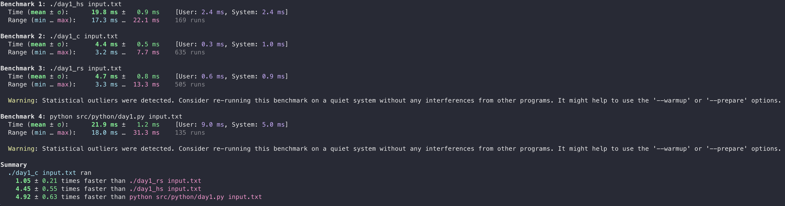

# Year 2017

## Day 1
**Haskell** proves really tricky to optimize; the setup of the haskell runtime etc seems to eat a lot of performance. Many attempts were made to get it to run faster, but in the end even just opening a file and counting the bytes in it takes about as much time as solving this task. The overhead is disappointing. The code looks super nice, for a haskeller at least. Still, for such a simple problem there really isn't much room to be astonishingly nice.
- Performance: ⭐
- Niceness: ⭐⭐⭐⭐

**Rust** runs much faster than haskell, and is a bit more explicit to read. Still, Rust code suffers from trying to thread the needle between functional and low-level idioms and always looks like... Rust.
- Performance: ⭐⭐⭐⭐⭐
- Niceness: ⭐⭐⭐⭐

**Python** does what I suspect it will do throughout the entire process: looks incredibly good way in the back of the race. This first problem was kind of low-level-ey and python then looks kind of low-level-ey, without looking frankensteined like Rust or pretentious like Haskell.
- Performance: ⭐
- Niceness: ⭐⭐⭐⭐⭐

**C** is of course the polar opposite of python... kind of. While somewhat harder to read (even when the file reading logic has been factored out of the solution file) it looks really clear and tells the story of arriving at the answer.
- Performance: ⭐⭐⭐⭐⭐
- Niceness: ⭐⭐⭐

## Benchmark

