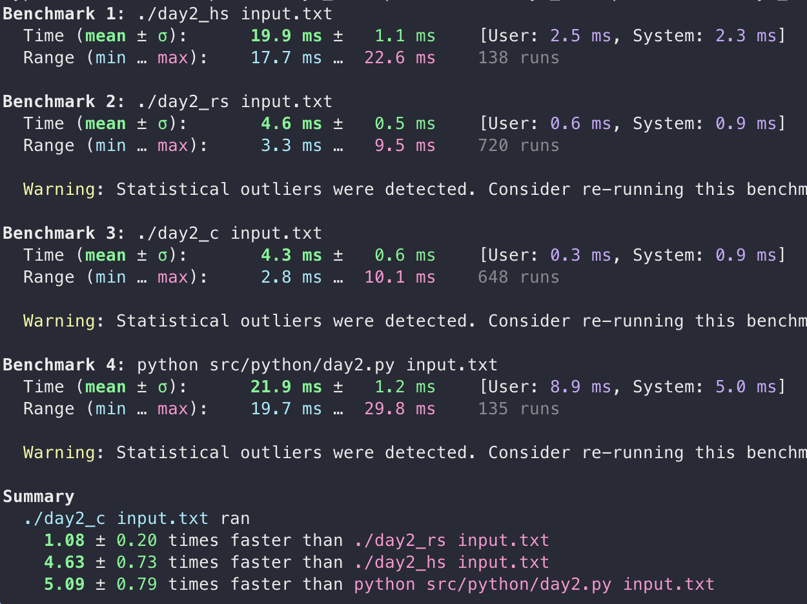

# Year 2017

## Day 2
**Haskell** doesn't really take any longer to solve this problem than the previous one; it was known that the file reading is the big bottleneck so that's no surprise. We'll see how it does later! I'm not sure if it traverses the list more than once... I think it does. But there's no point in optimizing it when the file reading takes so long.
- Performance: ⭐
- Niceness: ⭐⭐⭐⭐

**Rust** looks better when writing "haskell in rust" rather than "c++ in rust". The lambda syntax is remarkably ugly. Slices are cool!
- Performance: ⭐⭐⭐⭐⭐
- Niceness: ⭐⭐⭐

**Python** wins the (quite anecdotal) race of "speed of implementation" - possibly because I had already written 3 other solutions and work with python every day. Still, I wrote this solution in maybe 3 minutes. Still dog slow.
- Performance: ⭐
- Niceness: ⭐⭐⭐⭐⭐

**C** whups rust for this problem as well, performance-wise, but the readability decays _very_ rapidly with the complexity of the problem.
- Performance: ⭐⭐⭐⭐⭐
- Niceness: ⭐⭐

## Benchmark

