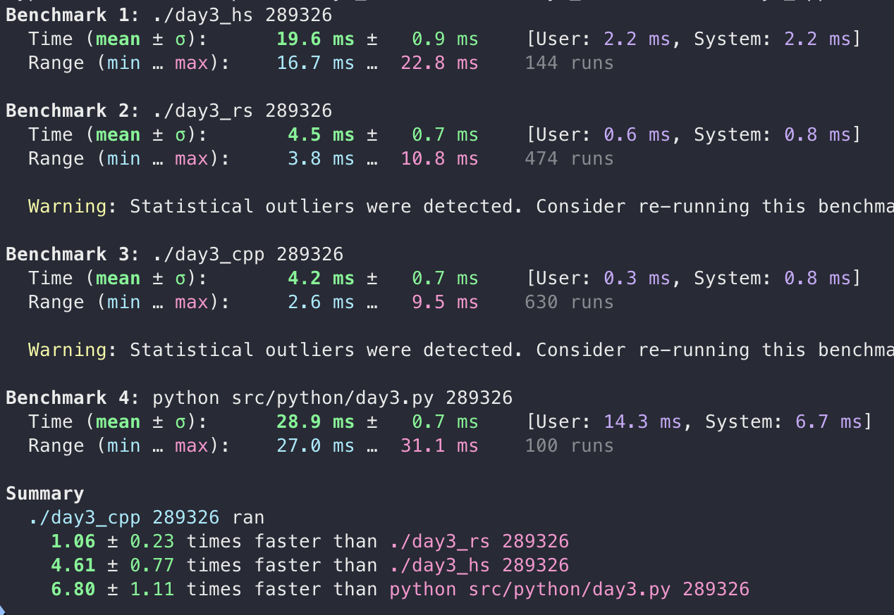

# Year 2017

## Day 3
**Haskell** is still scaling - the haskell solution is 1 ms slower than "hello world", essentially. It would be cool if haskell scaled really well for some performance-heavy problems! It still gets outperformed by the systems-level languages.
- Performance: ⭐
- Niceness: ⭐⭐⭐⭐

**Rust** acts a bit unintuitively (to me) with the strictness of the types; though I realized that I'm very lax about using unsigned integers in haskell but never in other languages so I guess that's on me. Here, rust mixes imperative and functional paradigms in a really natural way. However, the inability to express the `directions` vector as a comprehension together with some other stuff keeps the niceness down.
- Performance: ⭐⭐⭐⭐⭐
- Niceness: ⭐⭐⭐

**Python** is the prettiest, and the shortest (without golfing) code.
- Performance: ⭐
- Niceness: ⭐⭐⭐⭐⭐

**C++** takes the place of C here, as I won't touch anything requiring a hashmap in C. It wins handily in the performance race, but the requirement of a specialized hash function for a built-in type (`std::pair`) brings the niceness down, which `std::cout` would already do anyway. Using a recursive closure for the `findFirstLarger` function did not feel natural in C++, which makes performance slightly better (one was implemented first, but switched for a while loop) than rust... I think it still feels "rusty" but the slight unfairness should be mentioned.

- Performance: ⭐⭐⭐⭐⭐
- Niceness: ⭐

## Benchmark

